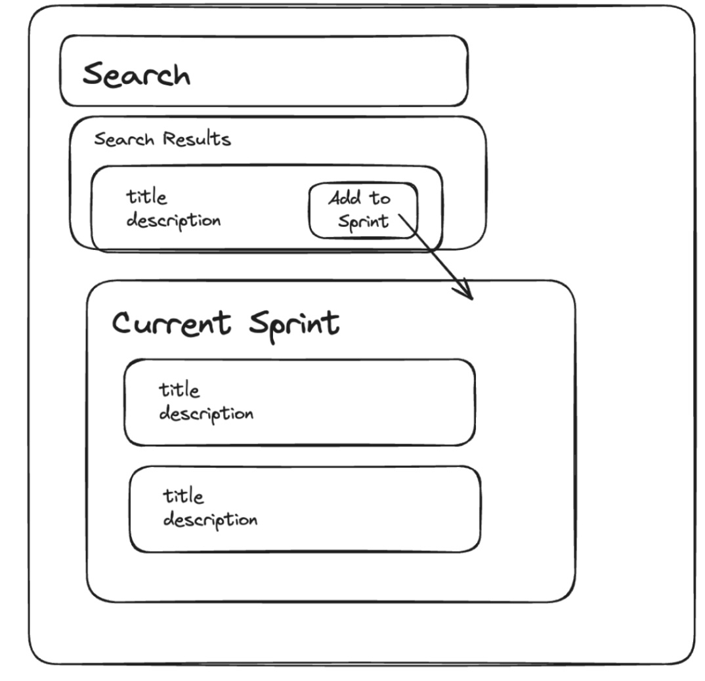

# HeyGen 前端面试

### **项目名称：任务看板 (Task Board)**

### **项目目标：**

构建一个任务看板应用，允许用户从通用任务池中搜索任务并将其添加到当前的冲刺（Sprint）中。用户还可以编辑任务的标题和描述，以及从冲刺中移除任务。

### **界面预览：**



### **API 详情：**

面试官将提供一个 Swagger 文档链接，详细描述所有 API 端点。以下是主要 API 概览：

- **GET `/tasks`**
  - 根据标题或描述搜索任务
- **GET `/current_sprint`**
  - 获取当前冲刺中的所有任务
- **POST `/current_sprint`**
  - 将任务添加到当前冲刺
- **PATCH `/tasks/{taskId}`**
  - 修改任务的标题和/或描述

**Swagger 文档链接：**
[https://de3a-64-124-162-234.ngrok-free.app/api-docs](https://de3a-64-124-162-234.ngrok-free.app/api-docs)

---

### **主要任务：**

1. **创建搜索栏**
   - 实现即时搜索功能（search-as-you-type），根据用户输入的关键词搜索任务。
2. **显示当前冲刺任务列表**

   - 展示当前冲刺中的所有任务，包括标题、描述和状态。

3. **添加任务到当前冲刺**

   - 允许用户从搜索结果中选择任务并添加到当前冲刺。如果任务已存在于冲刺中，则不进行重复添加。

4. **编辑任务（额外加分项）**

   - 支持用户编辑冲刺中任务的标题和描述。

5. **移除冲刺中的任务**
   - 在每个任务项旁提供移除按钮，允许用户从当前冲刺中移除任务。

---

### **技术要求：**

- **前端框架：** React
- **语言：** TypeScript
- **样式库：** Tailwind CSS
- **状态管理：** React Context
- **数据获取：** Fetch API
- **API 服务：** 使用本地 JSON 数据模拟 API（例如使用 `json-server`）
- **项目结构：** 组件化，代码可维护性高

---

### **核心考察点：**

1. **React 组件设计与拆分**
2. **状态管理：** 使用 React Context 管理全局状态
3. **TypeScript：** 类型定义与类型安全
4. **Tailwind CSS：** 高效的样式设计与响应式布局
5. **异步数据处理：** 使用 Fetch API 与后端交互
6. **表单与事件处理：** 实现搜索栏的交互逻辑
7. **API 交互与错误处理：** 与模拟 API 的交互及错误处理机制

---

## 分步教程：实现任务看板应用

### **步骤概览：**

1. 项目初始化与设置
2. 配置 Tailwind CSS
3. 创建本地 JSON API
4. 定义 TypeScript 类型
5. 构建 React 应用结构
6. 实现 React Context
7. 开发核心组件
   - 搜索栏组件
   - 搜索结果任务列表组件
   - 冲刺任务看板组件
   - 任务项组件
   - 编辑任务模态框组件（额外加分项）
8. 集成 Fetch API 与 API 通信
9. 样式与交互优化
10. 测试与调试

---

### **1. 项目初始化与设置**

首先，使用 **Create React App** 结合 **TypeScript** 模板初始化项目。

```bash
npx create-react-app task-board --template typescript
cd task-board
```

### **2. 配置 Tailwind CSS**

安装 Tailwind CSS 及其依赖，并进行配置。

```bash
npm install -D tailwindcss postcss autoprefixer
npx tailwindcss init -p
```

编辑 `tailwind.config.js`：

```javascript
/** @type {import('tailwindcss').Config} */
module.exports = {
  content: ["./src/**/*.{js,jsx,ts,tsx}"],
  theme: {
    extend: {},
  },
  plugins: [],
};
```

在 `src/index.css` 中引入 Tailwind 的基础样式：

```css
@tailwind base;
@tailwind components;
@tailwind utilities;
```

### **3. 创建本地 JSON API**

使用 `json-server` 作为本地的 API 服务。首先，安装 `json-server`。

```bash
npm install -D json-server
```

在项目根目录创建 `db.json` 文件，定义初始数据：

```json
{
  "tasks": [
    { "id": 1, "title": "设计登录页面", "description": "创建用户登录界面" },
    {
      "id": 2,
      "title": "实现认证功能",
      "description": "使用 JWT 实现用户认证"
    },
    { "id": 3, "title": "搭建数据库", "description": "选择并配置数据库系统" },
    { "id": 4, "title": "撰写 API 文档", "description": "详细记录 API 接口" },
    { "id": 5, "title": "前端测试", "description": "编写单元测试和集成测试" }
  ],
  "current_sprint": []
}
```

在 `package.json` 中添加启动 `json-server` 的脚本：

```json
"scripts": {
  "start": "react-scripts start",
  "server": "json-server --watch db.json --port 5000",
  "build": "react-scripts build",
  "test": "react-scripts test",
  "eject": "react-scripts eject"
},
```

启动 `json-server`：

```bash
npm run server
```

此时，API 端点如下：

- 获取所有任务： `GET http://localhost:5000/tasks?q=关键词`
- 获取当前冲刺任务： `GET http://localhost:5000/current_sprint`
- 添加任务到冲刺： `POST http://localhost:5000/current_sprint`
- 修改任务： `PATCH http://localhost:5000/tasks/{taskId}`
- 移除冲刺任务： `DELETE http://localhost:5000/current_sprint/{taskId}`

---

### **4. 定义 TypeScript 类型**

在 `src/types/index.ts` 中定义任务类型。

```typescript
// src/types/index.ts
export interface Task {
  id: number;
  title: string;
  description: string;
  status?: string; // 可选属性，视具体需求而定
}
```

---

### **5. 构建 React 应用结构**

规划应用的组件结构：

```
src/
├── components/
│   ├── SearchBar.tsx
│   ├── TaskList.tsx
│   ├── KanbanBoard.tsx
│   ├── TaskItem.tsx
│   └── EditTaskModal.tsx (额外加分项)
├── context/
│   └── KanbanContext.tsx
├── types/
│   └── index.ts
├── App.tsx
├── index.tsx
└── ...
```

---

### **6. 实现 React Context**

在 `src/context/KanbanContext.tsx` 中创建看板上下文，用于管理当前冲刺中的任务。

```typescript
// src/context/KanbanContext.tsx
import React, { createContext, useState, useEffect, ReactNode } from "react";
import { Task } from "../types";

interface KanbanContextType {
  sprintTasks: Task[];
  addTaskToSprint: (task: Task) => Promise<void>;
  removeTaskFromSprint: (id: number) => Promise<void>;
  updateTask: (id: number, updatedTask: Partial<Task>) => Promise<void>;
}

export const KanbanContext = createContext<KanbanContextType>({
  sprintTasks: [],
  addTaskToSprint: async () => {},
  removeTaskFromSprint: async () => {},
  updateTask: async () => {},
});

interface Props {
  children: ReactNode;
}

export const KanbanProvider: React.FC<Props> = ({ children }) => {
  const [sprintTasks, setSprintTasks] = useState<Task[]>([]);

  // 获取初始冲刺任务
  useEffect(() => {
    fetch("http://localhost:5000/current_sprint")
      .then((res) => res.json())
      .then((data: Task[]) => setSprintTasks(data))
      .catch((err) => console.error("获取冲刺任务错误:", err));
  }, []);

  // 添加任务到冲刺
  const addTaskToSprint = async (task: Task) => {
    // 检查任务是否已存在
    if (sprintTasks.find((t) => t.id === task.id)) return;

    try {
      const response = await fetch("http://localhost:5000/current_sprint", {
        method: "POST",
        headers: { "Content-Type": "application/json" },
        body: JSON.stringify(task),
      });
      const newTask: Task = await response.json();
      setSprintTasks([...sprintTasks, newTask]);
    } catch (error) {
      console.error("添加任务到冲刺错误:", error);
    }
  };

  // 从冲刺移除任务
  const removeTaskFromSprint = async (id: number) => {
    try {
      await fetch(`http://localhost:5000/current_sprint/${id}`, {
        method: "DELETE",
      });
      setSprintTasks(sprintTasks.filter((task) => task.id !== id));
    } catch (error) {
      console.error("从冲刺移除任务错误:", error);
    }
  };

  // 更新任务
  const updateTask = async (id: number, updatedTask: Partial<Task>) => {
    try {
      const response = await fetch(`http://localhost:5000/tasks/${id}`, {
        method: "PATCH",
        headers: { "Content-Type": "application/json" },
        body: JSON.stringify(updatedTask),
      });
      const updated: Task = await response.json();
      // 更新冲刺中的任务
      setSprintTasks(
        sprintTasks.map((task) => (task.id === id ? updated : task))
      );
    } catch (error) {
      console.error("更新任务错误:", error);
    }
  };

  return (
    <KanbanContext.Provider
      value={{ sprintTasks, addTaskToSprint, removeTaskFromSprint, updateTask }}
    >
      {children}
    </KanbanContext.Provider>
  );
};
```

---

### **7. 开发核心组件**

#### **a. 搜索栏组件**

实现搜索功能，允许用户输入关键词并展示匹配的任务列表。

```typescript
// src/components/SearchBar.tsx
import React, { useState, useEffect, useRef } from "react";
import TaskList from "./TaskList";
import { Task } from "../types";

const SearchBar: React.FC = () => {
  const [query, setQuery] = useState("");
  const [results, setResults] = useState<Task[]>([]);
  const [error, setError] = useState("");
  const debounceTimeout = useRef<NodeJS.Timeout | null>(null);

  const handleSearch = (searchQuery: string) => {
    if (!searchQuery.trim()) {
      setResults([]);
      setError("");
      return;
    }

    fetch(`http://localhost:5000/tasks?q=${encodeURIComponent(searchQuery)}`)
      .then((res) => res.json())
      .then((data: Task[]) => {
        setResults(data);
        setError("");
      })
      .catch((err) => {
        console.error("搜索错误:", err);
        setError("搜索失败，请稍后重试");
      });
  };

  // 实现防抖功能，避免每次输入都发送请求
  useEffect(() => {
    if (debounceTimeout.current) clearTimeout(debounceTimeout.current);
    debounceTimeout.current = setTimeout(() => {
      handleSearch(query);
    }, 300); // 300ms 后执行搜索
    return () => {
      if (debounceTimeout.current) clearTimeout(debounceTimeout.current);
    };
  }, [query]);

  return (
    <div className="my-4">
      <input
        type="text"
        value={query}
        onChange={(e) => setQuery(e.target.value)}
        placeholder="搜索任务..."
        className="w-full p-2 border border-gray-300 rounded-md focus:outline-none focus:ring-2 focus:ring-blue-500"
      />
      {error && <p className="text-red-500 mt-2">{error}</p>}
      <TaskList tasks={results} />
    </div>
  );
};

export default SearchBar;
```

**核心考察点：**

- **防抖（Debounce）**：优化搜索性能，避免频繁的 API 请求。
- **输入事件处理**：实时更新查询关键词并触发搜索。

#### **b. 任务列表组件**

展示搜索结果中的任务项，允许用户点击添加到冲刺。

```typescript
// src/components/TaskList.tsx
import React, { useContext } from "react";
import { Task } from "../types";
import { KanbanContext } from "../context/KanbanContext";

interface Props {
  tasks: Task[];
}

const TaskList: React.FC<Props> = ({ tasks }) => {
  const { sprintTasks, addTaskToSprint } = useContext(KanbanContext);

  const handleAdd = (task: Task) => {
    if (sprintTasks.find((t) => t.id === task.id)) {
      alert("任务已在当前冲刺中");
      return;
    }
    addTaskToSprint(task);
  };

  return (
    <div className="mt-4">
      {tasks.length === 0 ? (
        <p className="text-gray-500">无匹配任务</p>
      ) : (
        <ul>
          {tasks.map((task) => (
            <li
              key={task.id}
              className="border-b border-gray-200 py-2 flex justify-between items-center"
            >
              <div>
                <h3 className="text-lg font-medium">{task.title}</h3>
                <p className="text-sm text-gray-600">{task.description}</p>
              </div>
              <button
                onClick={() => handleAdd(task)}
                className="px-3 py-1 bg-green-500 text-white rounded-md hover:bg-green-600"
              >
                添加
              </button>
            </li>
          ))}
        </ul>
      )}
    </div>
  );
};

export default TaskList;
```

**核心考察点：**

- **条件渲染**：根据任务是否存在于冲刺中显示不同的提示。
- **事件处理**：添加任务到冲刺的逻辑实现。

#### **c. 冲刺任务看板组件**

展示当前冲刺中的任务，允许用户移除任务。

```typescript
// src/components/KanbanBoard.tsx
import React, { useContext } from "react";
import { KanbanContext } from "../context/KanbanContext";
import TaskItem from "./TaskItem";

const KanbanBoard: React.FC = () => {
  const { sprintTasks } = useContext(KanbanContext);

  return (
    <div className="mt-8">
      <h2 className="text-xl font-semibold mb-4">当前冲刺</h2>
      {sprintTasks.length === 0 ? (
        <p className="text-gray-500">冲刺中暂无任务</p>
      ) : (
        <ul>
          {sprintTasks.map((task) => (
            <TaskItem key={task.id} task={task} />
          ))}
        </ul>
      )}
    </div>
  );
};

export default KanbanBoard;
```

**核心考察点：**

- **列表渲染**：展示冲刺中的任务列表。
- **组件复用**：使用独立的 `TaskItem` 组件提高代码复用性。

#### **d. 任务项组件**

展示单个任务项，包括标题、描述和移除按钮。支持编辑功能（额外加分项）。

```typescript
// src/components/TaskItem.tsx
import React, { useContext, useState } from "react";
import { Task } from "../types";
import { KanbanContext } from "../context/KanbanContext";
import EditTaskModal from "./EditTaskModal";

interface Props {
  task: Task;
}

const TaskItem: React.FC<Props> = ({ task }) => {
  const { removeTaskFromSprint } = useContext(KanbanContext);
  const [isEditing, setIsEditing] = useState(false);

  const handleRemove = () => {
    if (window.confirm("确定要移除这个任务吗？")) {
      removeTaskFromSprint(task.id);
    }
  };

  return (
    <li className="border-b border-gray-200 py-2 flex justify-between items-center">
      <div>
        <h3 className="text-lg font-medium">{task.title}</h3>
        <p className="text-sm text-gray-600">{task.description}</p>
      </div>
      <div className="flex space-x-2">
        <button
          onClick={() => setIsEditing(true)}
          className="px-3 py-1 bg-blue-500 text-white rounded-md hover:bg-blue-600"
        >
          编辑
        </button>
        <button
          onClick={handleRemove}
          className="px-3 py-1 bg-red-500 text-white rounded-md hover:bg-red-600"
        >
          移除
        </button>
      </div>
      {isEditing && (
        <EditTaskModal task={task} onClose={() => setIsEditing(false)} />
      )}
    </li>
  );
};

export default TaskItem;
```

**核心考察点：**

- **条件渲染**：根据编辑状态显示或隐藏编辑模态框。
- **事件处理**：移除任务和打开编辑模态框的逻辑实现。

#### **e. 编辑任务模态框组件（额外加分项）**

允许用户编辑任务的标题和描述。

```typescript
// src/components/EditTaskModal.tsx
import React, { useState, useContext } from "react";
import { Task } from "../types";
import { KanbanContext } from "../context/KanbanContext";

interface Props {
  task: Task;
  onClose: () => void;
}

const EditTaskModal: React.FC<Props> = ({ task, onClose }) => {
  const { updateTask } = useContext(KanbanContext);
  const [title, setTitle] = useState(task.title);
  const [description, setDescription] = useState(task.description);
  const [error, setError] = useState("");

  const handleSubmit = async (e: React.FormEvent) => {
    e.preventDefault();
    if (!title.trim()) {
      setError("标题不能为空");
      return;
    }
    try {
      await updateTask(task.id, { title, description });
      onClose();
    } catch (err) {
      console.error("编辑任务错误:", err);
      setError("编辑任务失败，请稍后重试");
    }
  };

  return (
    <div className="fixed inset-0 flex items-center justify-center bg-black bg-opacity-50">
      <div className="bg-white p-6 rounded-md w-96">
        <h2 className="text-xl font-semibold mb-4">编辑任务</h2>
        <form onSubmit={handleSubmit} className="space-y-4">
          <div>
            <label className="block text-sm font-medium text-gray-700">
              标题
            </label>
            <input
              type="text"
              value={title}
              onChange={(e) => setTitle(e.target.value)}
              className="w-full p-2 border border-gray-300 rounded-md focus:outline-none focus:ring-2 focus:ring-blue-500"
            />
          </div>
          <div>
            <label className="block text-sm font-medium text-gray-700">
              描述
            </label>
            <textarea
              value={description}
              onChange={(e) => setDescription(e.target.value)}
              className="w-full p-2 border border-gray-300 rounded-md focus:outline-none focus:ring-2 focus:ring-blue-500"
              rows={4}
            />
          </div>
          {error && <p className="text-red-500">{error}</p>}
          <div className="flex justify-end space-x-2">
            <button
              type="button"
              onClick={onClose}
              className="px-4 py-2 bg-gray-300 text-gray-700 rounded-md hover:bg-gray-400"
            >
              取消
            </button>
            <button
              type="submit"
              className="px-4 py-2 bg-blue-500 text-white rounded-md hover:bg-blue-600"
            >
              保存
            </button>
          </div>
        </form>
      </div>
    </div>
  );
};

export default EditTaskModal;
```

**核心考察点：**

- **表单处理**：处理表单输入和提交逻辑。
- **状态管理**：通过 Context 更新任务状态。
- **错误处理**：显示错误信息并进行适当反馈。

---

### **8. 集成 Fetch API 与 API 通信**

在上述组件中已经通过 Fetch API 实现了与本地 JSON API 的通信，包括获取任务列表、添加任务到冲刺、编辑任务和移除任务。确保所有 API 调用都是异步的，并处理可能的错误。

**注意事项：**

- **错误处理**：在每个 API 调用中捕获错误并提供用户友好的提示。
- **数据同步**：确保前端状态与后端数据保持同步，避免数据不一致。

---

### **9. 样式与交互优化**

使用 Tailwind CSS 进行快速样式设计，确保应用具有良好的用户界面和响应式布局。

#### **a. 基础布局**

在 `App.tsx` 中设置基本布局和样式。

```typescript
// src/App.tsx
import React from "react";
import { KanbanProvider } from "./context/KanbanContext";
import SearchBar from "./components/SearchBar";
import KanbanBoard from "./components/KanbanBoard";

const App: React.FC = () => {
  return (
    <KanbanProvider>
      <div className="container mx-auto p-4">
        <h1 className="text-3xl font-bold text-center mb-6">任务管理看板</h1>
        <SearchBar />
        <KanbanBoard />
      </div>
    </KanbanProvider>
  );
};

export default App;
```

#### **b. 任务项样式**

确保任务项在搜索结果和冲刺看板中具有一致且清晰的样式，按钮颜色区分不同操作（添加为绿色，移除为红色，编辑为蓝色）。

#### **c. 响应式设计**

利用 Tailwind 的响应式类，确保应用在不同设备上均能良好展示。

---

### **10. 测试与调试**

#### **a. 运行应用**

确保 `json-server` 正在运行：

```bash
npm run server
```

启动 React 应用：

```bash
npm start
```

在浏览器中访问 `http://localhost:3000`，测试各项功能：

- **搜索任务**：在搜索栏中输入关键词，观察实时搜索结果。
- **添加任务到冲刺**：点击搜索结果中的“添加”按钮，将任务添加到冲刺中。
- **查看冲刺任务**：在冲刺看板中查看已添加的任务。
- **编辑任务**（额外加分项）：点击冲刺任务中的“编辑”按钮，修改任务标题和描述。
- **移除任务**：点击冲刺任务中的“移除”按钮，从冲刺中删除任务。
- **错误处理**：尝试添加重复任务，检查是否有相应的提示。

#### **b. 调试 API 交互**

使用浏览器的开发者工具（F12）查看网络请求，确保 API 调用正确，响应正常。

- **查看请求**：确认所有 API 请求的 URL、方法和请求体是否正确。
- **检查响应**：确保 API 返回的数据格式符合预期，前端能够正确解析和使用。

---

## 核心考察部分解析

### 1. **React 组件设计与拆分**

- **组件复用性**：将应用拆分为 `SearchBar`、`TaskList`、`KanbanBoard`、`TaskItem` 和 `EditTaskModal` 等组件，每个组件职责单一，便于复用和维护。
- **清晰的层级结构**：确保组件之间的关系清晰，父组件与子组件之间通过 props 或 Context 进行数据传递。

### 2. **React Context 的使用**

- **全局状态管理**：使用 React Context 管理冲刺中的任务状态，避免层层传递 props。
- **Provider 与 Consumer**：理解如何创建 Context Provider 并在子组件中消费 Context 数据。

### 3. **TypeScript 的类型安全**

- **类型定义**：为任务定义接口 `Task`，在组件中使用 TypeScript 强化类型安全，避免潜在的类型错误。
- **类型注解**：在函数参数和返回值中使用类型注解，提高代码的可读性和维护性。

### 4. **Tailwind CSS 的应用**

- **实用类的使用**：通过 Tailwind 的实用类快速实现布局和样式，提升开发效率。
- **响应式设计**：利用 Tailwind 的响应式类，确保应用在不同设备上良好展示。

### 5. **异步数据处理与 Fetch API**

- **数据获取与提交**：使用 Fetch API 进行异步数据获取（GET）和数据提交（POST、PATCH、DELETE）。
- **错误处理**：在每个 Fetch 调用中捕获错误并提供用户友好的提示，提升应用的健壮性。

### 6. **表单与事件处理**

- **搜索栏交互**：实现输入事件处理和防抖（Debounce）机制，优化搜索性能。
- **按钮点击事件**：处理添加、移除和编辑任务的点击事件，确保用户交互的流畅性。

### 7. **API 交互与错误处理**

- **与后端通信**：理解 RESTful API 的基本操作，通过 Fetch API 与后端进行数据交互。
- **数据同步**：确保前端状态与后端数据保持同步，避免数据不一致。

---

## 总结与进一步学习建议

通过以上分步教程，你将能够实现一个功能完整、结构清晰的任务看板应用，涵盖了前端开发中的多个关键知识点。这不仅有助于准备 HeyGen 的前端面试，还能提升你在实际项目中的开发能力。

### **进一步学习建议：**

1. **深入 React Hooks：**

   - 学习 `useReducer`、`useMemo` 等高级 Hooks，管理更复杂的状态和优化性能。
   - 探索自定义 Hooks，提升代码复用性。

2. **高级 TypeScript：**

   - 理解泛型、联合类型、交叉类型等高级类型特性，编写更灵活和安全的代码。
   - 学习如何与第三方库（如 `react-router`、`axios`）结合使用 TypeScript。

3. **状态管理工具：**

   - 探索更强大的状态管理工具，如 Redux、MobX，理解其在大型应用中的应用场景。

4. **测试与质量保障：**

   - 学习编写单元测试和集成测试，使用工具如 Jest 和 React Testing Library，确保代码的稳定性和可靠性。
   - 了解代码质量工具，如 ESLint、Prettier，保持代码的一致性和规范性。

5. **性能优化：**

   - 学习 React 的性能优化技巧，如代码分割、懒加载、使用 `React.memo` 等，提升应用的加载速度和响应性能。

6. **后端交互与安全：**

   - 深入理解前后端分离架构，学习如何处理认证与授权（如 JWT）。
   - 了解 CORS、CSRF 等安全机制，确保应用的安全性。

7. **持续集成与部署：**
   - 学习使用 CI/CD 工具，如 GitHub Actions、Travis CI，自动化测试和部署流程。
   - 探索部署平台，如 Vercel、Netlify，快速将项目上线。

### **行动步骤建议：**

1. **实践项目：**

   - 持续开发和完善个人项目，如任务看板、博客系统、电商平台等，巩固所学知识。
   - 参与开源项目，贡献代码，提升协作能力和代码质量。

2. **复习与总结：**

   - 定期回顾学习内容，整理笔记，总结关键知识点和常见问题。
   - 通过博客或技术分享，将所学知识整理成文档，加深理解。

3. **模拟面试：**
   - 与朋友或同事进行模拟面试，练习如何清晰表达思路和解决问题。
   - 使用在线模拟面试平台，如 [Pramp](https://www.pramp.com/) 进行实际演练。

通过系统化的学习和不断的实践，你将能够全面掌握前端开发中的关键知识点，轻松应对各种面试挑战。祝你复习顺利，面试成功！

# HeyGen 前端面试任务看板原题

You are going to be making a task board that looks like below. The goal is allow users to search for tasks from a general pool of tasks and add them to the current sprint. You will be given a backend API.

API
Interviewer will share an API URL that is swagger docs that contains details of all the APIs. In summary we have the following APIs
https://de3a-64-124-162-234.ngrok-free.app/api-docs

GET `/tasks`

- Search for tasks by title or description
  GET `/current_sprint`
- Gets all the tasks in the current sprint
  POST `/current_sprint`
- Add a task to the current sprint
  PATCH `/tasks/{taskId}`
- Change title and/or description

### Tasks to be Done

- Create a search bar that searches-as-you-type tasks.
- Display a list of tasks in the current sprint
- Each task will show
  - Title
  - Description
  - Status
- Support adding a task from search results to the current sprint

### Extra Credit

Support editing a task
